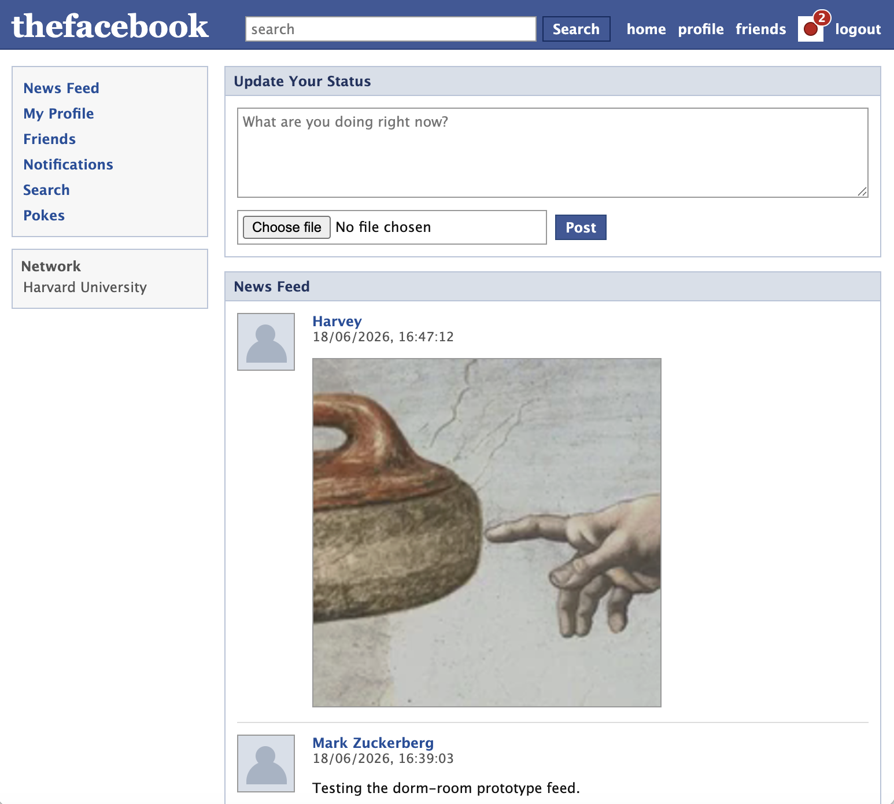

# `codex-thefacebook`

Despite not really using coding agents at work, I like to run little experiments here and there to gauge their capabilities. Here we try to see if codex can reproduce this classic site from ~20 years ago using just a single prompt.

## The prompt (Codex-GPT 5.5 Medium)

```
Create me a working prototype of the early ‘thefacebook’ as it was in 2005. 

With respect to the technical architecture, I propose keeping it simple - it does not need to be hyper-scalable! In particular
- Use pocketbase on the backend (using javascript)
- A simple SPA/html site on the frontend will suffice

For the site itself, here is the key functionality:
- Auth can just be an email and password, users will need to be able to sign up.
- Users will need to be able to poke each other.
- Users will need to be able to make friend requests to each other.
- Users will need to be able to search for each other.
- Users will need to be able to create posts and upload images.
- In particular, users will need to be able to upload a profile picture. As a placeholder for this, use the classic default icon.
- There needs to be a paginated news feed, showing content posted by friends.
- There needs to be a  notification system for receiving pokes and friends requests, add a little red icon on the top right for when there are any pending.
- It needs to roughly resemble the original Facebook. Include the classic logo at the top left and a copyright message at the bottom.
- Create a couple of accounts for the original cofounders as part of your testing, so that new users can jump in and use the site.
```
## The result

Pretty impressive (and rather nostalgic to jump in and play with!). All the key functionality is there and the visuals are pretty spot on.

There are some janky ways in which the UI responds, but perhaps not dissimilar to how Web 2.0 felt like at the time.

As far as the code itself:
- The frontend code, located in a single file, is quite large. Despite having no comments, it is fairly readable. Perhaps another prompt here could seperate large blocks of code into a more coherent structure using modules.
- The initialisation code on the backend is relatively compact, as expected when using a framework like PocketBase. DB schema and the seeding procedure are sensible. 
- This setup should be fairly secure out of the blocks. However, all user content is escaped only when it is displayed on the frontend.

<hr>


<small><i>Codex's shot at the most important page - the news feed.</i></small>
<br>

<small><i>Friend requests, poke functionality - works flawlessly.</i></small>
<br>

<small><i>A little uninventive for the design of the homepage, but does the job.</i></small>
